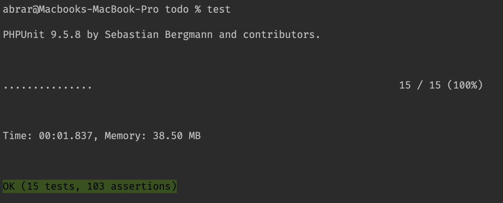

# Setup Project 
- First, clone project by using `git clone https://github.com/abrardev99/todo.git` 
- Copy .env.example file using `cp .env.example .env` and setup database.
- run `composer install`

### Seed initial data for testing purposes. 
run `php artisan migrate --seed`. 
this will seed one user and few todos.
- User credentials
Email: `user@demo.com`
Password: `password`

### Testing
- Postman collection
  

- I wrote feature tests. 2 reason, 1: I have enough time, 2: I feel bored by manual testing. 
Run `phpunit` to execute automatic tests.
  

### Note
For testing purpose, I'm sending mail to log driver for testing purposes. 
